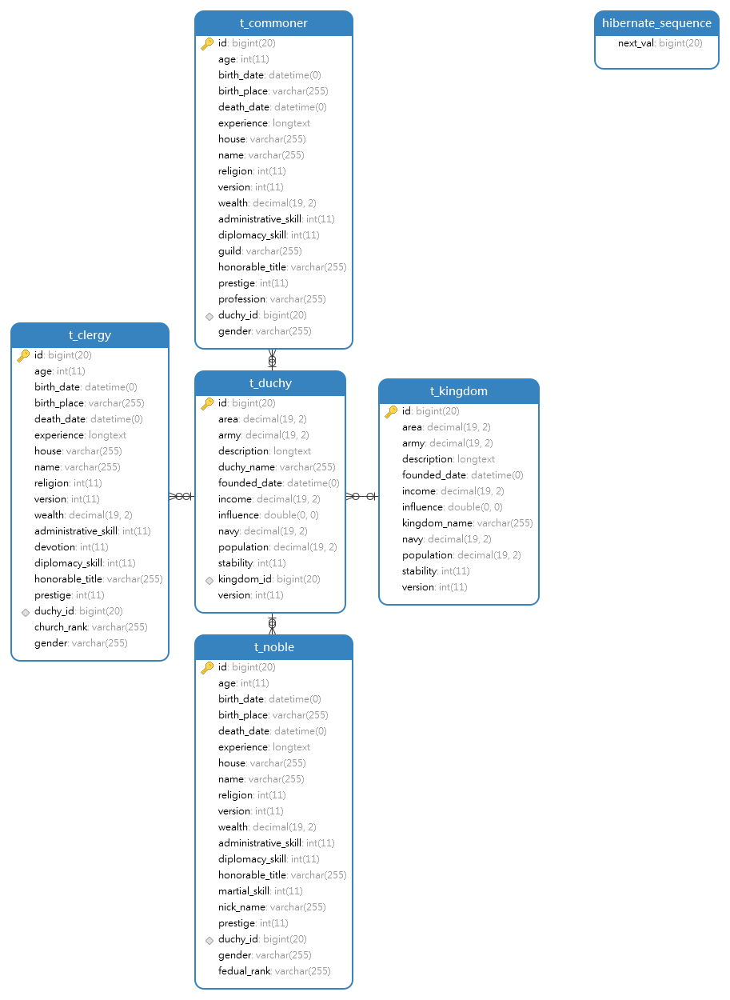

# Spring Cloud Self Learning Project

### 介绍
- 基于Spring Boot/Spring Cloud/Spring Security/Kubernetes/Docker 鼓捣新技术栈的小项目
- 对应项目/模块目录下有README.md说明代码实现

### 软件架构
- 后端：Spring Boot, Spring Cloud, Spring Security
- 前端: Vue.js, Thymeleaf
- ORM：Spring Data Jpa, Spring Data Redis, Mybatis
- 消息中间件: RabbitMQ
- 数据库: MySQL
- NoSQL: Redis, MongoDB
- **待学习: ElasticSearch, Neo4j, Kafka, PostgreSQL**

### 计划

- [x] Spring Security Oauth2 JWT SSO
- [x] Spring Data JPA 高级用法
- [ ] 设计高并发接口/性能优化/乐观锁
- [ ] Spring Session + Redis 会话集群
- [ ] Mycat分库分表, UUID, 索引优化
- [ ] 预研并行编程/WebFlux/响应式编程
- [ ] 预研Kubernetes集群 + 微服务高可用
- [ ] 预研Istio

### 项目结构

|  目录   |   |说明  |
|  ----  | ----  | ----  |
| base-config | | 给my-config用的git配置项目录 |
| DEV_OPS | | Kubernetes,Docker相关内容 |
| SRC_CODE  | | 源代码 |
| **spring-cloud-base**  | | 微服务治理 |
| |  my-eureka  | eureka  |
| |  my-config  | 配置中心 |
| |  my-hystrix  | hystrix监控  |
| |  my-turbine  |  turbine监控 |
| | my-zipkin-2  | zipkin监控  |
|  **rest-api-base**  | | REST API  |
| | my-cache | Redis公共缓存模块 |
| | my-sso-client | Oauth2 SSO Client |
| | my-sso-authorization | Oauth2 SSO 授权服务器 |
| | my-sso-resource | Oauth2 SSO 资源服务器(由Zuul替代) |
| | my-zuul | Zuul网关，兼做资源服务器 |
| | my-kingdom | Kingdom微服务，负责提供REST API |
|  **client-sdk-base**  | | 客户端/SDK  |
| | my-chancellor | Chancellor客户端,负责调用REST API |

### 开发工具(推荐)

- Intell IDEA 2019.1
- Navicat/ SQLyog / MySQL WorkBench / SQLyog
- Another RedisDesktopManager
- Docker Windows Desktop
- Github Desktop
- Chrome F12
- Postman

------------

# 已完成服务
##  Spring Security Oauth2 JWT SSO + Spring Cloud
### 关键词
请不熟悉Oauth2的同学谷歌下列关键词:
Oauth2, SSO, JWT, 授权码模式，对称加密，非对称加密，Token

### 相关链接
- Postman Collection: [Postman请求集合](https://www.getpostman.com/collections/45a34833c51cdf77dd17)

------------

### 代码实现
 - 各模块使用授权码模式提供SSO服务，必须由客户端登录--拿到Token(通过JWT实现)--访问资源服务器。为方便本地开发，已将Zuul和资源服务器整合（即Zuul兼做资源服务器），需要通过客户端访问Oauth2 Authorization/Token接口拿到Token，再访问Zuul，再通过反向代理请求其他微服务接口。具体端口配置请见各模块`application.properties`/`application.yml`。正常开发中，可通过Zuul反向代理/负载均衡 授权或资源服务器，只不过所有微服务都必须编写资源服务器相关的Spring Security代码（应该也可以封装单独模块简化开发)。
 - POSTMAN本地测试不能直接去Zuul请求授权服务器的Token,因为它自己就是资源服务器。

------------
### 相关链接

- [What is the OAuth 2.0 Authorization Code Grant Type?](https://developer.okta.com/blog/2018/04/10/oauth-authorization-code-grant-type "What is the OAuth 2.0 Authorization Code Grant Type?")

- [Authorize access to Azure Active Directory web applications using the OAuth 2.0 code grant flow](https://docs.microsoft.com/en-us/azure/active-directory/develop/v1-protocols-oauth-code "Authorize access to Azure Active Directory web applications using the OAuth 2.0 code grant flow")
- [Handle Security in Zuul, with OAuth2 and JWT](https://www.baeldung.com/spring-security-zuul-oauth-jwt "Handle Security in Zuul, with OAuth2 and JWT")

- [Simple Single Sign-On with Spring Security OAuth2](https://www.baeldung.com/sso-spring-security-oauth2 "Simple Single Sign-On with Spring Security OAuth2")

# My-Kingdom 服务
### Mysql 8 表结构
后续还会修改，添加表或者修改字段，添加索引等

计划是模拟一个中世纪国家，包括封建等级制度/三级会议/教会/犹太人/战争/社会经济等。

