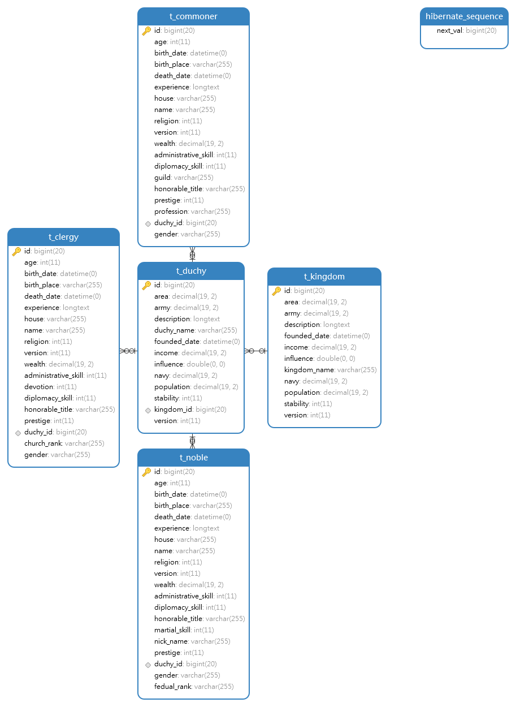

##  Spring Security Oauth2 JWT SSO + Spring Cloud
### 关键词
请不熟悉Oauth2的同学谷歌下列关键词:
Oauth2, SSO, JWT, 授权码模式，对称加密，非对称加密，Token

------------

### 代码实现
 - 各模块使用授权码模式提供SSO服务，必须由客户端登录--拿到Token(通过JWT实现)--访问资源服务器。为方便本地开发，已将Zuul和资源服务器整合（即Zuul兼做资源服务器），需要通过客户端访问Oauth2 Authorization/Token接口拿到Token，再访问Zuul，再通过反向代理请求其他微服务接口。具体端口配置请见各模块`application.properties`/`application.yml`。正常开发中，可通过Zuul反向代理/负载均衡 授权或资源服务器，只不过所有微服务都必须编写资源服务器相关的Spring Security代码（应该也可以封装单独模块简化开发)。
 - POSTMAN本地测试不能直接去Zuul请求授权服务器的Token,因为它自己就是资源服务器。

------------
### 相关链接

- [What is the OAuth 2.0 Authorization Code Grant Type?](https://developer.okta.com/blog/2018/04/10/oauth-authorization-code-grant-type "What is the OAuth 2.0 Authorization Code Grant Type?")

- [Authorize access to Azure Active Directory web applications using the OAuth 2.0 code grant flow](https://docs.microsoft.com/en-us/azure/active-directory/develop/v1-protocols-oauth-code "Authorize access to Azure Active Directory web applications using the OAuth 2.0 code grant flow")
- [Handle Security in Zuul, with OAuth2 and JWT](https://www.baeldung.com/spring-security-zuul-oauth-jwt "Handle Security in Zuul, with OAuth2 and JWT")

- [Simple Single Sign-On with Spring Security OAuth2](https://www.baeldung.com/sso-spring-security-oauth2 "Simple Single Sign-On with Spring Security OAuth2")

# My-Kingdom业务微服务
### Mysql 8 表结构
后续还会修改，添加表或者修改字段，添加索引等

